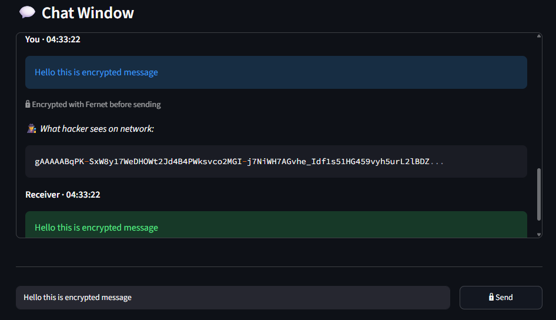

# 🔐 Secure Chat Application Using Network Security

> MCA Final Year Project · Eluri Sandhya (23B21F00E9) · KIET, JNTU-K · 2024-2025

A real-time **end-to-end encrypted** chat application built with Python and Streamlit.  
Messages are encrypted using **Fernet (AES-128-CBC)** and the session key is exchanged securely using **RSA-2048** asymmetric encryption.

---

## 🚀 Live Demo

[][(https://secure-chat-application ∙ main ∙ app.py)]

---

## 🛠️ Tech Stack

| Layer | Technology |
|---|---|
| Frontend / UI | Python, Streamlit |
| Message Encryption | Fernet (AES-128-CBC) |
| Key Exchange | RSA-2048 (asymmetric) |
| Database | MySQL (signup, login, chat rooms) |
| Security | SQL injection & XSS prevention |

---

## ✨ Features

- 🔒 **End-to-end encryption** — every message encrypted using Fernet before sending
- 🔑 **RSA key exchange** — session key shared securely using asymmetric encryption
- 👤 **User authentication** — password-based login with MySQL database
- 🛡️ **Security hardened** — protected against SQL injection and XSS attacks
- 📊 **Live encryption demo** — encrypt/decrypt any text in real time
- 💬 **Chat rooms** — public and private rooms with password protection

---

## 📸 Screenshots

| Chat Window | Encryption Demo |
|---|---|
|  |  |

---

## 🧪 Test Cases (Chapter 7 — Project Report)

| Test No | Test Case | Result |
|---|---|---|
| T1 | Signup (valid) | ✅ Pass |
| T2 | Signup (invalid) | ✅ Fail |
| T3 | Login (valid) | ✅ Pass |
| T4 | Login (invalid) | ✅ Fail |
| T5 | Create room | ✅ Pass |
| T6 | Join room (valid) | ✅ Pass |
| T7 | Join room (invalid) | ✅ Fail |
| T8 | View registered users | ✅ Pass |

> 📄 Source: Chapter 7 · Testing & Validation · MCA Project Report · KIET, JNTU-K

---

## ▶️ How to Run Locally

**Step 1 — Clone the repository**
```bash
git clone https://github.com/sandhyaeluri/secure-chat-application.git
cd secure-chat-application
```

**Step 2 — Install dependencies**
```bash
pip install -r requirements.txt
```

**Step 3 — Run the app**
```bash
streamlit run app.py
```

---

## 🔐 How Encryption Works

```
Sender types message
        ↓
Fernet key encrypts message → "gAAAAABl...X7mK9p==" (unreadable)
        ↓
Travels across network as cipher text
        ↓
Receiver uses shared Fernet key to decrypt
        ↓
Receiver reads original message
```

---

## 📁 Project Structure

```
secure-chat-application/
│
├── app.py                ← Main Streamlit application
├── requirements.txt      ← Python dependencies
├── README.md             ← Project documentation
├── index.html            ← Portfolio page
└── screenshots/          ← App screenshots
    ├── chat_window.png
    └── encryption_demo.png
```

---

## 📚 References

- Cryptography and Network Security — Behrouz A. Forouzan
- Python Cryptography Library — https://cryptography.io
- Streamlit Documentation — https://docs.streamlit.io

---

## 👩‍💻 Author

**Eluri Sandhya**  
MCA — Kakinada Institute of Engineering & Technology, JNTU-K  
📧 sandhyaeluri26@gmail.com
